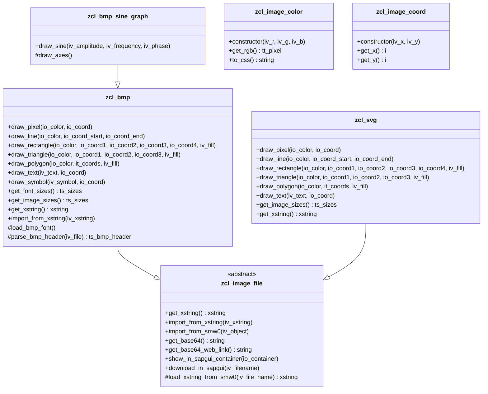

# ABAP Image Generator

This project provides a set of ABAP classes and example programs for generating and manipulating BMP (bitmap) and SVG (Scalable Vector Graphics) images directly within SAP. It includes utilities for drawing basic shapes, lines, polygons, and text, as well as a demonstration for plotting a sine graph and displaying or downloading the resulting BMP image in SAP GUI.

## Features

- **BMP Image Generation**: Create BMP images of arbitrary size.
- **SVG Image Generation**: Create SVG images with vector graphics that scale without loss of quality.
- **Drawing Primitives**: Draw pixels, lines, rectangles, triangles, polygons, and filled shapes.
- **Text Rendering**: Render text and symbols onto the BMP using a bitmap font.
- **SAP GUI Integration**: Display images in a custom container or download them directly from SAP GUI.

## Structure

- `zcl_image_file`: Abstract base class for image file operations (e.g., loading, exporting, displaying, downloading images).
- `zcl_bmp`: Core class for BMP image creation and drawing operations.
- `zcl_image_color`, `zcl_image_coord`: Helper classes for color and coordinate management.
- `zcl_svg`: Core class for SVG image creation and drawing operations (vector graphics).
- `z_bmp_smw0_downloader`: Function module (in function group `Z_BMP`) to download files (such as BMP fonts or images) from SAP's SMW0 repository to the application server or presentation server.
- `zcl_bmp_sine_graph`: Example class for drawing a sine graph.
- `zshow_sine_bmp.abap`: Example program to display a sine graph BMP in a SAP GUI container.
- `zdownload_sine_bmp.abap`: Example program to generate and download a sine graph BMP.

## Usage

### Drawing Custom Images

You can use the `zcl_bmp` or `zcl_svg` classes directly to create custom images:

```abap
DATA(lo_bmp) = NEW zcl_bmp( iv_width = 400 iv_height = 300 ).
" Draw a red line
lo_bmp->draw_line(
  io_color = NEW zcl_image_color( iv_r = 255 iv_g = 0 iv_b = 0 )
  io_coord_start = NEW zcl_image_coord( iv_x = 10 iv_y = 10 )
  io_coord_end   = NEW zcl_image_coord( iv_x = 390 iv_y = 290 )
).
" Export as xstring or display/download as needed
DATA(lv_xstring) = lo_bmp->get_xstring( ).
```

## Examples

### Display Sine Graph in SAP GUI

This program generates a sine graph and displays it in a custom SAP GUI container.

```abap
REPORT zshow_sine_bmp.

DATA: lv_width  TYPE i VALUE 600,
      lv_height TYPE i VALUE 600.

DATA: lo_container TYPE REF TO cl_gui_custom_container.

START-OF-SELECTION.

  DATA(lo_graph) = NEW zcl_bmp_sine_graph( iv_width = lv_width iv_height = lv_height ).
  lo_graph->draw_sine( ).

  " Create container and HTML viewer
  CALL SCREEN 100.

* Screen 100 should have a custom control named 'PICTURE_AREA'
MODULE status_0100 OUTPUT.
  IF lo_container IS INITIAL.
    lo_container = NEW cl_gui_custom_container( 'PICTURE_AREA' ).
    lo_graph->show_in_sapgui_container( lo_container ).
  ENDIF.
ENDMODULE.
```

**Screen 100** must be created in SE51 with a custom control named `PICTURE_AREA`.

### Download Sine Graph as BMP

This program generates a sine graph and prompts the user to download the BMP file.

```abap
REPORT zdownload_sine_bmp.

DATA:
  lv_width    TYPE i VALUE 600,
  lv_height   TYPE i VALUE 600.

DATA(lo_graph) = NEW zcl_bmp_sine_graph( iv_width = lv_width iv_height = lv_height ).
lo_graph->draw_sine( ).
lo_graph->download_in_sapgui( ).
```

## Font Generation and Custom Fonts

This project supports custom bitmap fonts for text rendering in BMP images.  
An example font (`font_cp1251.bmp`) and a Python script (`converter.py`) for generating BMP fonts are provided in the `bmp_font_generator/` directory.

- **font_cp1251.bmp**: Example bitmap font (CP1251 encoding).
- **converter.py**: Script to convert TTF fonts to BMP format suitable for use in ABAP.

To use your own font:
1. Use `converter.py` to generate a BMP font from a TTF file.
2. Upload the resulting BMP to SAP (e.g., via SMW0) and reference it in your ABAP code.

## Class Diagram

Below is a class diagram showing the main classes and their relationships:



## Requirements

- SAP NetWeaver system with ABAP stack.
- Authorization to create and run custom ABAP classes and reports.
- (Optional) SAP GUI for Windows for full GUI integration.

## Installation

You can install this project conveniently with [abapGit](https://github.com/abapGit):

1. In your SAP system, open transaction `ZABAPGIT` (or run the abapGit report) and clone this repository URL.
2. Pull the repository and activate the imported objects.
3. (Optional) For GUI display examples, create the required screen (e.g., 100) with a custom control named `PICTURE_AREA`.

## Customization

- Extend `zcl_bmp_sine_graph` or create your own subclasses of `zcl_bmp` or `zcl_svg` for custom drawing logic.
- Use helper classes for color (`zcl_image_color`) and coordinates (`zcl_image_coord`).

## License

MIT License